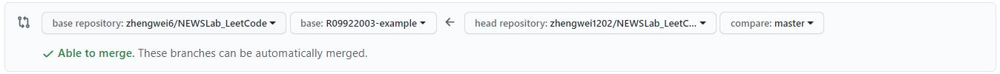
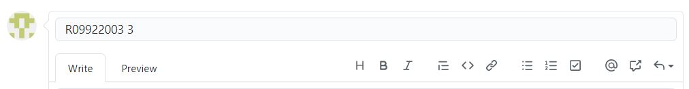

# NEWSLab_LeetCode
This repository is for NTU NEWSLab students to practice LeetCode.

## How to practice
1. Fork [this repository](https://github.com/zhengwei6/NEWSLab_LeetCode) on GitHub 
2. Write down following info in your `README.md`
    - GitHub account name
    - Student ID
    - Your name
3. Write your solutions in forked repository
4. Create a GitHub pull request
    - Choose `zhengwei6/NEWSLab_LeetCode` as base repository and `{your student ID}` as base branch
    - Choose branch in your forked repository as compare branch
    
    - Name it with student ID and number of solved questions e.g. `R09922003 3`
    
5. We will accept pull requests weekly.

